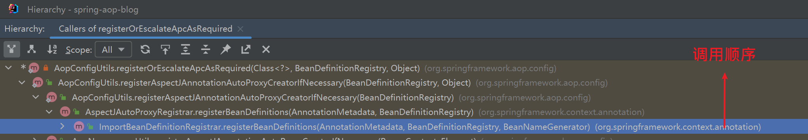
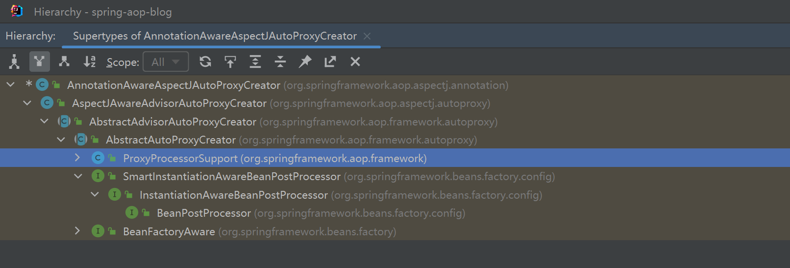

### 什么是AOP？

todo。。。

### spring中aop的自动配置
- #### 代理的类型
    1. ##### jdk动态代理
        使用jdk自带的`java.lang.reflect.Proxy`实现
    2. ##### cglib代理
        基于继承的。。。
- #### 区别 & 优势
  。。。

  ***spring boot2.0***之后默认实现方式改为`cglib`方式，之前为`jdk动态代理`(参考 `org.springframework.boot.autoconfigure.aop.AopAutoConfiguration.AspectJAutoProxyingConfiguration.CglibAutoProxyConfiguration`)

### 如何工作的？
- #### 开启AOP
  1. `@EnableAspectJAutoProxy`

     `@EnableAspectJAutoProxy`导入一个实现了`ImportBeanDefinitionRegistrar`的`AspectJAutoProxyRegistrar`,参考 
    
     `AspectJAutoProxyRegistrar`会向bean factory注册一个名为`org.springframework.aop.config.internalAutoProxyCreator`class为`AnnotationAwareAspectJAutoProxyCreator`的对象,这个类的父类如下